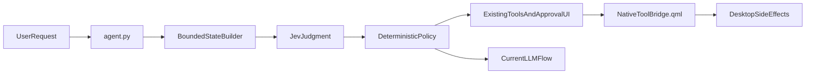

# Jev MVP integration plan

## Design stance

Jev should not become another general-purpose agent, a generated-command engine, or a permission oracle. The MVP will use it only for closed-set judgments where the shell already owns the candidates and the side effects:

- Route obvious Spotlight requests to an existing path, but keep ambiguous requests on the current LLM flow.
- Select a live window from a bounded, freshly fetched candidate list; never let Jev invent an address.
- Tighten the existing computer-use critical-action check; never use Jev to make a risky action safer by itself.

The first behavior change will be preceded by shadow mode. If Jev adds latency without reducing ambiguity or unnecessary tool-loop work, that feature will not be promoted.

## Implementation todos

- **jev-client** — Add a small official-SDK adapter at `[scripts/ai/jev.py](/home/nix-napkin/ambxst+/scripts/ai/jev.py)`.
  - Construct the client with the `typesafe` key retrieved through the existing `ToolContext`/KeyStore path; do not read credentials from argv or expose them to QML.
  - Use `jev-latest`, a bounded request timeout, limited retries, and explicit unavailable/error results.
  - Normalize Choice, Score, and Noul responses into plain Python data containing the selected value, probabilities, confidence, and request latency.
  - Keep the adapter lazy: no network request during shell startup, model discovery, or ordinary chats unless a Jev-enabled decision is reached.
- **package-jev** — Make the official Python SDK available in both development and packaged environments through `[nix/packages/tools.nix](/home/nix-napkin/ambxst+/nix/packages/tools.nix)` and `[shell.nix](/home/nix-napkin/ambxst+/shell.nix)`.
  - Pin the SDK/package source in Nix if it is not already available as a nixpkgs Python package.
  - Verify the installed import name and current SDK API against the live TypeSafe Python documentation before wiring code to it.
  - Keep the dependency optional at runtime: a missing SDK or missing key must cleanly select the existing non-Jev path.
- **jev-config** — Add minimal opt-in configuration, updating both `[config/defaults/ai.js](/home/nix-napkin/ambxst+/config/defaults/ai.js)` and `[config/Config.qml](/home/nix-napkin/ambxst+/config/Config.qml)` as required by the config system.
  - Add one feature mode with `off`, `shadow`, and `active` states, plus a conservative timeout and confidence threshold.
  - Add a `typesafe` credential entry in the AI settings surface `[modules/widgets/config/AiPanel.qml](/home/nix-napkin/ambxst+/modules/widgets/config/AiPanel.qml)` using the existing KeyStore controls.
  - Default to `off` so installing the package cannot change behavior or send desktop context remotely.
- **jev-context** — Extend the Python-side turn context in `[scripts/ai/agent.py](/home/nix-napkin/ambxst+/scripts/ai/agent.py)` and `[scripts/ai/tools/registry.py](/home/nix-napkin/ambxst+/scripts/ai/tools/registry.py)` only enough to pass the current user request and current turn state to the adapter.
  - Keep state explicit and minimized: user text, intent-relevant desktop facts, and bounded candidate records.
  - Do not send full clipboard databases, notification histories, notes, screenshots, tool transcripts, API keys, or arbitrary file contents to Jev.
  - Include turn/request identifiers so stale candidate answers can be discarded before dispatch.
- **shadow-evaluation** — Implement shadow judgments first, with no user-visible behavior changes.
  - **Intent:** evaluate a closed Choice over `native_read`, `native_write`, `focus_window`, `conversation`, and `clarify` for requests that already enter Spotlight. Record only aggregate outcome, confidence, latency, and fallback reason.
  - **Window selection:** when the existing flow obtains `get_windows`, give Jev the user request and a capped list of current `{address, title, class, pid, focused}` records. Compare its selected address with the LLM’s eventual choice; never dispatch the Jev result in shadow mode.
  - **Computer-use safety:** for only actions that reach the existing critical-action path, evaluate the action summary, control label/role, focused application, and explicit critical flags. Compare Jev with `action_is_critical()` in `[scripts/ai/tools/computer_use.py](/home/nix-napkin/ambxst+/scripts/ai/tools/computer_use.py)` without changing the approval result.
  - Add privacy-safe counters and structured diagnostics rather than raw request logging.
- **promote-safe-routing** — After representative fixtures show a useful win, activate only high-confidence, low-risk intent routes in `[scripts/ai/agent.py](/home/nix-napkin/ambxst+/scripts/ai/agent.py)`.
  - Direct routing is limited to existing native read/write operations whose arguments are closed-set or already validated; writes continue through the existing execution profile and approval flow.
  - A low-confidence or multi-intent result must fall back to the current LLM/tool loop or the existing `ask_user_question` path.
  - Do not add a new QML protocol or duplicate native side effects; reuse the existing `native_request` event and `[modules/services/ai/NativeToolBridge.qml](/home/nix-napkin/ambxst+/modules/services/ai/NativeToolBridge.qml)`.
- **promote-window-selection** — Add Jev-assisted window resolution only after a deterministic shortlist exists.
  - Accept `none` as an explicit Choice outcome and require a confidence threshold plus a unique viable candidate.
  - Revalidate the selected window address immediately before calling the existing `focus_window` path; if the window disappeared or the candidate set changed, fall back instead of acting.
  - Keep title/class substring matching and the current LLM path as offline fallbacks.
- **promote-safety-verification** — Integrate the Jev safety judgment around, not inside, the existing permission rules in `[scripts/ai/tools/computer_use.py](/home/nix-napkin/ambxst+/scripts/ai/tools/computer_use.py)` and `[scripts/ai/execution_profile.py](/home/nix-napkin/ambxst+/scripts/ai/execution_profile.py)`.
  - Existing explicit critical flags and regex checks remain hard positives.
  - Jev positive or uncertain results force the existing approval route; Jev failure leaves the existing result unchanged.
  - Jev must never override `Never`, directory restrictions, command denylists, user rejection, lock state, or the current computer-use session gate.
  - Avoid a Jev request for routine screenshots, snapshots, focus, scrolling, or typing; only assess potentially irreversible actions.
- **test-and-gate** — Add deterministic tests and validation in `[tests/test_scripts.py](/home/nix-napkin/ambxst+/tests/test_scripts.py)`.
  - Test typed response parsing, missing-key behavior, SDK/network timeout, cancellation, malformed answers, and offline fallback with a fake Jev client.
  - Test that disabled/shadow mode leaves existing dispatch and approval decisions unchanged.
  - Test stale window IDs, `none` selections, low confidence, explicit critical flags, and Jev disagreement with the regex gate.
  - Run `python3 tests/test_scripts.py`, ShellCheck for changed shell files if any, and `nix flake check`/the dev-shell import check for packaging.

## Promotion gates

- `off` mode makes zero Jev requests and preserves current behavior.
- Jev unavailable, timed out, unauthorized, or malformed responses produce a deterministic fallback with no user-visible failure beyond existing behavior.
- No active feature dispatches a model-generated address, command, file path, diff, click coordinate, or approval decision.
- Window selection only acts on a fresh candidate ID and a high-confidence unique result.
- Safety verification can increase review but can never reduce an existing review requirement.
- Shadow data demonstrates a measurable benefit—fewer unnecessary tool iterations or fewer ambiguous window selections—before active routing is enabled.

## Explicitly defer

Do not add Jev to every launcher keystroke, clipboard update, notification arrival, or computer-use step. Defer semantic clipboard/notes search, notification triage, settings navigation, and launcher reranking until those surfaces expose bounded candidate APIs and the MVP measurements show that their deterministic search is insufficient. Do not use Jev to generate shell commands, diffs, prose, or computer-use coordinates.